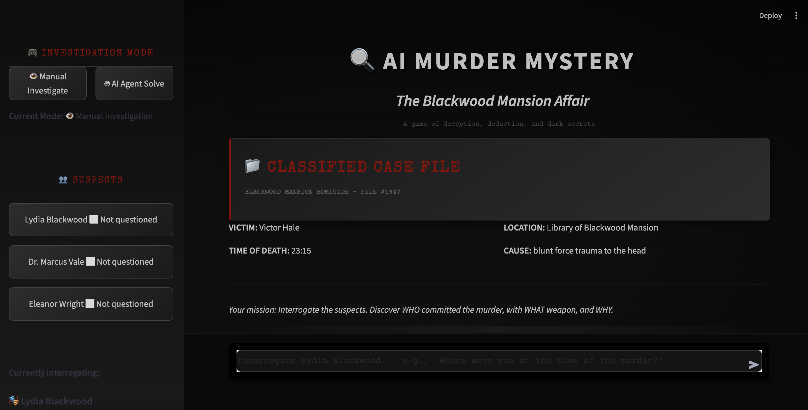

# 🕵️ AI Murder Mystery – Multi-Agent LLM Investigation System

<p align="center">
  
</p>

An interactive murder mystery game built using a **role-specialized multi-agent architecture**, where Large Language Models simulate suspects, enforce narrative constraints, and evaluate final accusations.

The system demonstrates how **multiple LLM agents with different responsibilities and models** can be orchestrated to create a structured, turn-based reasoning environment.

---

## 📌 Key Features

- 🧠 **Multi-agent architecture** with clearly separated roles  
- 🎭 **Persona-driven suspect agents** with private knowledge and deception  
- 🛡️ **Critique agent** to enforce safety, consistency, and redlines  
- ⚖️ **Evaluation agent** to judge final accusations  
- ⏱️ **Turn-based gameplay** (30 turns maximum)  
- 👤 **Two player modes**
  - Human Player (manual interrogation)
  - AI Agent Player (automated solve mode)
- ⚡ **Fast inference** using Groq API  

---

## 🧩 System Overview


The system is controlled by a central **Game Engine**, which manages state and routes interactions between agents.

### Player Types

- **Human Player**  
  Manually asks questions and submits the final accusation.

- **AI Agent Player**  
  Automatically generates questions and attempts to solve the case.

Both player types interact with the same backend pipeline.

---

## 🤖 Agents & Responsibilities

The system consists of **five agents** in total.

### 1️⃣ Suspect Agents (3)

Each suspect is implemented as a **separate LLM agent**, configured with:
- A unique persona
- Public information
- Private knowledge
- Hard redlines (forbidden admissions)

**Roles represented**
- Killer  
- Accomplice  
- Innocent witness  

**Task**  
Generate persona-conditioned, deceptive dialogue during interrogation.

---

### 2️⃣ Critique Agent (1)

Acts as a **safety and consistency layer**.

**Responsibilities**
- Filters suspect responses  
- Prevents information leaks  
- Ensures suspects remain in character  
- Enforces global and local narrative constraints  

---

### 3️⃣ Evaluation Agent (1)

Invoked only during the **final accusation phase**.

**Responsibilities**
- Analyze the player’s accusation (suspect, weapon, motive)  
- Reason over the full interrogation history  
- Generate a narrative case resolution  
- Support scoring and verdict generation  

---

## 🧠 Model Selection Strategy

Different LLaMA models are used intentionally based on task requirements.

| Agent Type | Model Used | Reason |
|-----------|-----------|--------|
| Suspect Agents | `llama-3.1-8b-instant` | Low latency, frequent calls, fast dialogue |
| Critique Agent | `llama-3.1-8b-instant` | Fast filtering and consistency checks |
| Evaluation Agent | `llama-3.3-70b-versatile` | Deep reasoning over long context |

This design ensures:
- **Fast interactive gameplay**
- **High-quality final reasoning**
- **Efficient use of compute resources**

---

## 🔄 Interaction Flow

### Interrogation Phase

1. Player asks a question  
2. Game Engine routes it to the selected Suspect Agent  
3. Suspect generates a raw response  
4. Critique Agent filters the response  
5. Final response is displayed to the player  

### Accusation Phase

1. Player submits an accusation  
2. Evaluation Agent analyzes the case  
3. Game Engine computes verdict and score  
4. Case resolution is displayed  

---

## ⏱️ Turn-Based Design

- Maximum of **30 turns** per game  
- Each question consumes one turn  
- Encourages strategic interrogation  
- Prevents exhaustive or brute-force querying  

---

## 🛠️ Tech Stack

- **Frontend**: Streamlit  
- **Agent Framework**: Agno  
- **LLMs**: LLaMA 3.1 8B, LLaMA 3.3 70B  
- **Inference Backend**: Groq API  
- **Language**: Python  

---

## 🚀 Setup & Run

### 1️⃣ Install Dependencies
```bash
pip install -r requirements.txt
